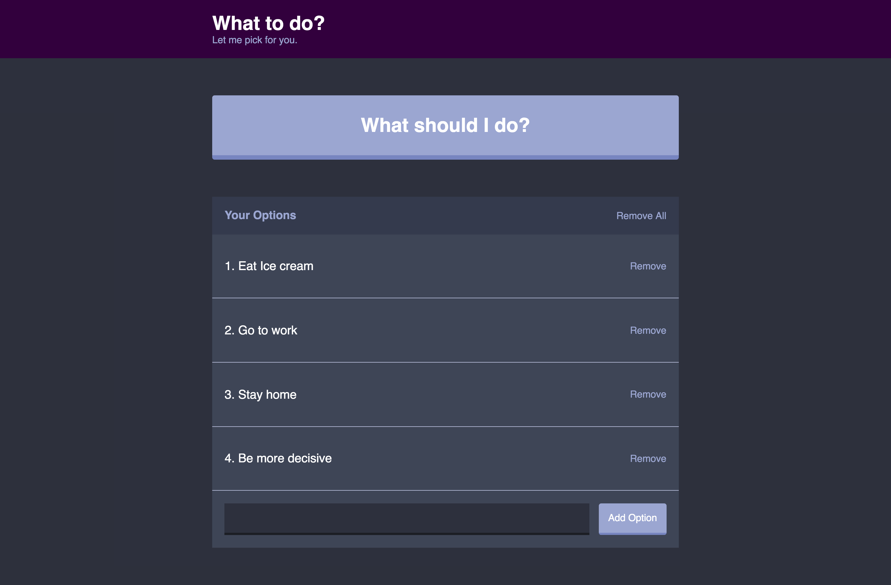
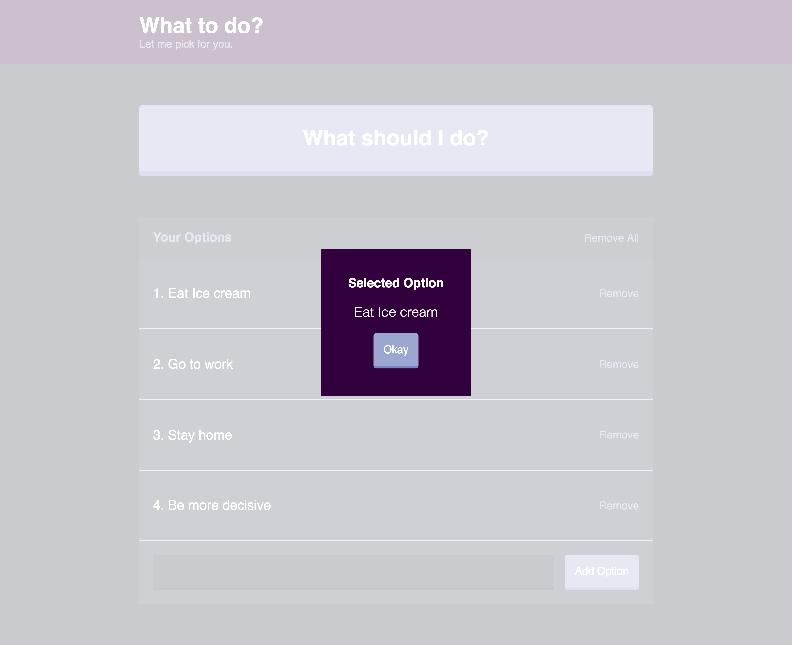
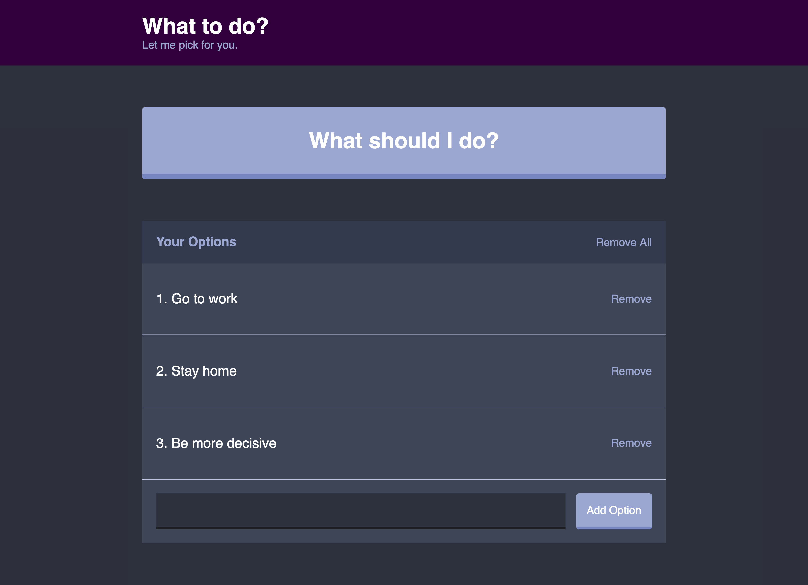

# What to Do?
> Being Decisive is too hard

What to do lets you add any tasks on your mind to a todo list, rather than choose what to do yourself, let the computer decide for you. Once you finish that task, remove it from your list and do it all over again. The fun never ends.






## Usage
To run locally, first install the necessary dependencies ```yarn``` then start the server ```yarn dev```. Open localhost:8080

## Technologies Used
* React
* Webpack
* ES6
* SCSS
